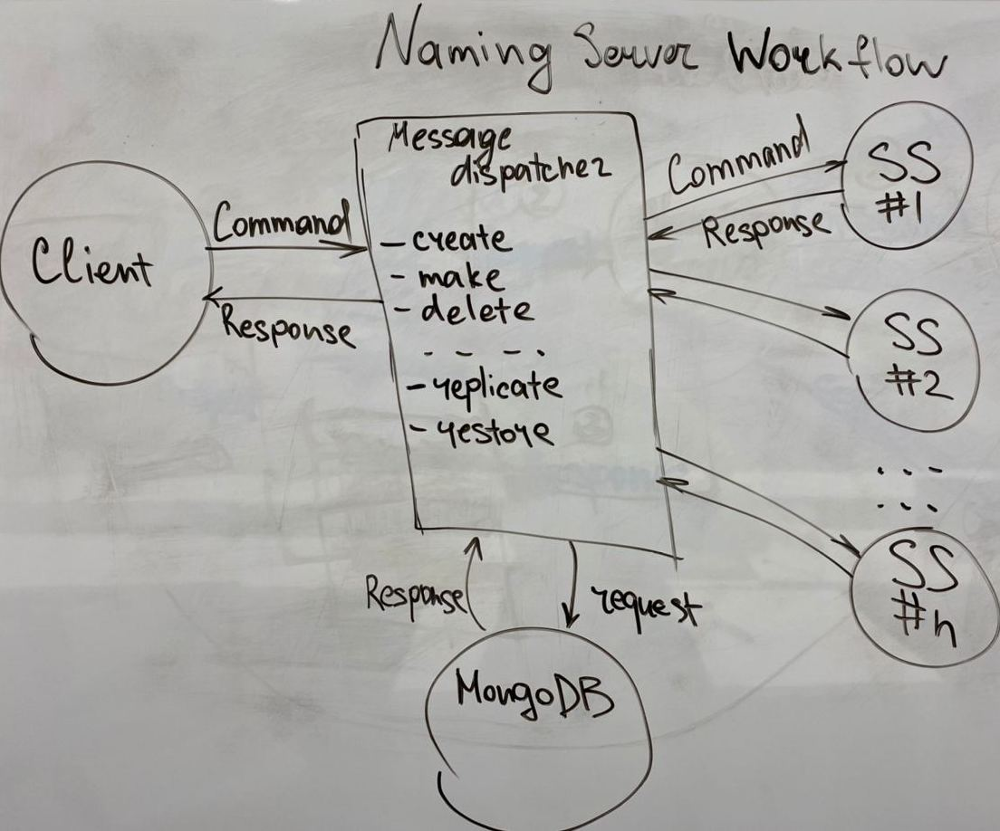

# Group Project 2: Distributed File System

## Team
Kureikin Maks

## Project description
The Distributed File System (DFS) is a file system with data stored on a server. The data is accessed and processed as if it was stored on the local client machine. The DFS makes it convenient to share information and files among users on a network.

## Installation

Use the docker engine [docker](https://www.docker.com) and [docker hub](https://hub.docker.com/) to install DFS.   
Installation base for each instance:
```bash
sudo apt-get update
sudo snap install docker
```
Installation of Naming server [maxitosh/namingserver](https://hub.docker.com/repository/docker/maxitosh/namingserver):
```bash
docker pull maxitosh/namingserver
docker-compose up
```
docker-compose.yml for Naming server.  
```dockerfile
version: "3.8"
services:
  namingserver:
    container_name: namingserver
    image: maxitosh/namingserver:latest
    environment:
      - "PYTHONUNBUFFERED=1"
    command: ["python3", "NamingServer.py"]
    ports:
      - 8800:8800

  mongodb:
    image: mongo:latest
    container_name: mongodb
    ports:
      - 27017:27017
    volumes:
      - ./MongoDB/data:/data/db/
      - ./MongoDB/:/usr/src/app/
```
Installation of Storage server [maxitosh/storageserver](https://hub.docker.com/repository/docker/maxitosh/storageserver):
```bash
docker pull maxitosh/storageserver
docker-compose up
```
docker-compose.yml for Storage server.
```dockerfile
version: "3.8"
services:
  namingserver:
    container_name: storageserver
    image: maxitosh/storageserver:latest
    environment:
      - "PYTHONUNBUFFERED=1"
      - "HOSTNAME=ss1"
    entrypoint: ["python3", "StorageServer.py"]
    volumes:
      - ./data/:/usr/src/app/data/
    ports:
      - 8800:8800
```
For each Storage server use different *HOSTNAME*.  

Naming and Storage servers should be launched on distinct machines and located in the subnet
for communication purposes.

Installation of Client console [maxitosh/clientconsole](https://hub.docker.com/repository/docker/maxitosh/clientconsole)

## Usage
Enter Naming server ip:   


Available commands in client console.  


## Structure of DFS


The idea of this DFS structure is to split the area between clients and DFS
system itself.  
Nodes of DFS are in private, isolated subnet so that provides
security measurements.  
Naming server is an entry point which controls incoming
requests and manipulates the recourses of DFS.

## DFS workflow


When a client wishes to access a file, it:
* contacts the naming server to obtain information about the storage server hosting it 
* communicates directly with the storage server to complete the operation

## Client workflow


Usage of client console allows user to manipulate over the DFS, using an interface
that makes the distributed nature of the system transparent to the user.

## Naming server workflow
 

The naming server tracks the file system directory tree, and associates each file in the file system to storage servers.  
When a client wishes to perform an operation on a file, it first contacts the naming server to obtain information about the storage server hosting the file, and then performs the operation on a storage server.  
Naming servers also provide a way for storage servers to register their presence.

The naming server can be thought of as an object containing a data structure which represents the current state of the file system directory tree, and providing several operations on it. 

## Storage server workflow
 

The primary function of storage servers is to provide clients with access to file data.  
Clients access storage servers in order to read and write files.  
Storage servers must respond to certain commands from the naming server.

## Description of communication protocols
All nodes in DFS uses such structure of messages to communicate:
```python
{'command': '[COMMAND_NAME]', 'arg[1]':'arg[1]_value', ..., 'arg[n]': 'arg[n]_value'} 
```
For example, command for file uploading:
```python
message = {'command': 'write_file', 'file_name': file_name, 'size': file_size}
```

On each mode exists message dispatcher that takes message and calls appropriate function:
```python
def dispatch_command(self, command):
    return getattr(self, 'do_' + command["command"], None)

def do_init(self, args)
def do_create_file(self, args)
...
...
def do_delete_directory(self, args)
```

Also nodes send response message of the same form, to handle either a success or an occurred error:
```python
{'status': 'OK'}
{'status': 'Failed'}
```
